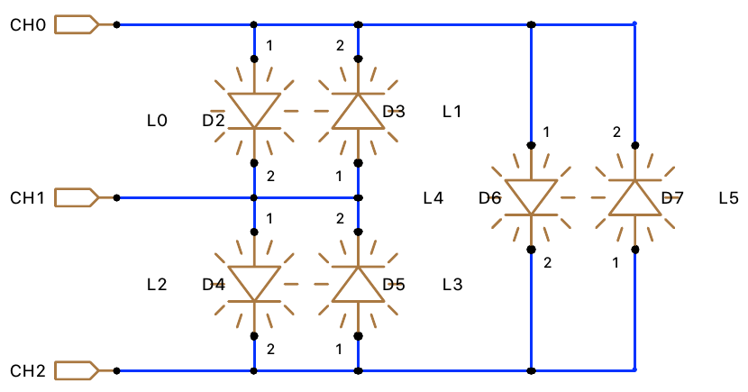

# Master Coro Lab board

The lab board is based on the Nucleo STM32F303K8 µC from ST. The schematic is available [here](./board/schematics.pdf).

This files gives some information about the peripherals connected on the board

# Led
15 leds are available on the board, using 3 different accesses.
## Direct access
One green led (near the reset connector) is connected to `PB0`.

| PB0 | Led state |
|-----|-----------|
| 0   | off       |
| 1   | on        |

## Charlieplexing

The [Charlieplexing](https://en.wikipedia.org/wiki/Charlieplexing)  is a technique to drive a lot of multiplexed leds through a limited number of pins.
The implementation on the lab board uses 3 I/O to drive 6 leds:

| pin | name |
|-----|------|
| PB7 | CH0  |
| PF0 | CH1  |
| PF1 | CH2  |

## I/O Expander

8 leds are connected through the external I/O expander MCP23S17 (see below), using PA0 to PA7.

# push-buttons

6 push buttons are available on the board, 2 with a direct access, and 4 through the I/O expander.

## Direct Access

2 push-button are directly connected:

| description               | pin  |
|---------------------------|------|
| button of the encoder(D5) | PB6  |
| blue push-button (D6)     | PB1  |

For each one, the pin state is:

| button     | pin state      |
|------------|----------------|
| pushed     | GND (0V)       |
| released   | high impedance |

## I/O Expander

4 push-buttons are connected through the external I/O expander MCP23S17 (see below), using PB4 to PB7.

# Potentiometer

The potentiometer is associated to `PA3`, and `ADC1_IN4` (ADC1, input channel 4) is used (12 bits):

| pot                       | voltage |  adc value |
|---------------------------|---------|------------|
| blocked clockwise         | 0V      | 0          |
| blocked counter-clockwise | 3.3V    | 4095       |

The value can be read using the provided `adc.h/c` provided filed.

# Encoder

The [incremental encoder](https://en.wikipedia.org/wiki/Incremental_encoder) si connected to 2 I/Os A and B. There is no `Z` line.
A push button is also provided with the encoder (see section push-button).

| description               | pin  | timer          |
|---------------------------|------|----------------|
| button of the encoder(D5) | PB6  |                |
| signal A                  | PA0  | TIM2 channel 1 |
| signal B                  | PA1  | TIM2 channel 2 |

There is an external pull-up for signals A and B.

The encoder can be associated to the timer TIM2, that can be configured to directly decode the encoder signal.

# I/O Expander

The I/O expander is based on a [MCP23S17 chip](http://ww1.microchip.com/downloads/en/DeviceDoc/20001952C.pdf). It has a SPI interface with the MCU and provides 2 8-bits I/O ports, port A and port B.

| port       | usage          |
|------------|----------------|
| PORTA 0..7 | 8 leds         |
| PORTB 0..3 | 4 dip switchs  |
| PORTB 4..7 | 4 push buttons |

The SPI connection between the MCU and the MCP23S17 is:

| name     | STM32 pin       | description          |
|----------|-----------------|----------------------|
| /CS      | PA11 / SPI1_CS  | Chip select          |
| SCK      | PB3 / SPI1_SCK  | Serial clock         |
| MOSI     | PB5 / SPI1_MOSI | Master Out, Slave In |
| MISO     | PB4 / SPI1_MISO | Master In, Slave Out |
| INTEXP   | PA9             | interrupt on PORT B  |
| RESET    | RESET           | reset circuit        |

The 4 lines are the basic SPI serial communication lines.
`INTEXP` is connected to the `INTB` pin of the MCP23S17 and is used to send an interrupt on port B. As PORTA have only ouputs (leds), the interrupt line is not connected.

An external connector is provided with lines `A0` to `A7` and `B0` to `B7` to connect to an oscilloscope.

# TFT Display

The 1.8" color TFT display is an [Adafruit product](https://www.adafruit.com/product/358). It uses the SPI interface (as the I/O expander), with an I/O to switch between data and command mode.

| name     | STM32 pin       | description            |
|----------|-----------------|------------------------|
| TFT_CS   | PA4             | Chip select            |
| SCK      | PB3 / SPI1_SCK  | Serial clock           |
| MOSI     | PB5 / SPI1_MOSI | Master Out, Slave In   |
| MISO     | PB4 / SPI1_MISO | Master In, Slave Out   |
| D/C      | PA12            | Data / Command switch  |

The TFT circuit is also connected to the RESET circuit. The backlight is always on, and cannot be modified.
The embedded SD card reader cannot be used with this lab board.

A driver for the TFT display is provided, based on the Adafruit libraries [Adafruit-ST7735](https://github.com/adafruit/Adafruit-ST7735-Library) and [Adafruit-GFX](https://github.com/adafruit/Adafruit-GFX-Library), originally targetting Arduino framework.

More information on how to use it [here](./tft.md) (software interface).

# External connectors

There are 3 external connectors just above the TFT display. The servo and stepper motor connection requires an external supply (11-15V).

## Servo

## stepper motor
## ultrasonic sensor
