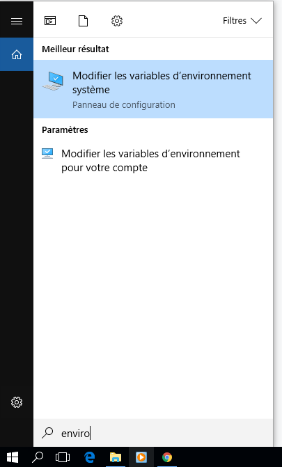
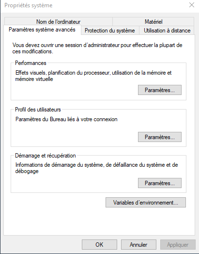
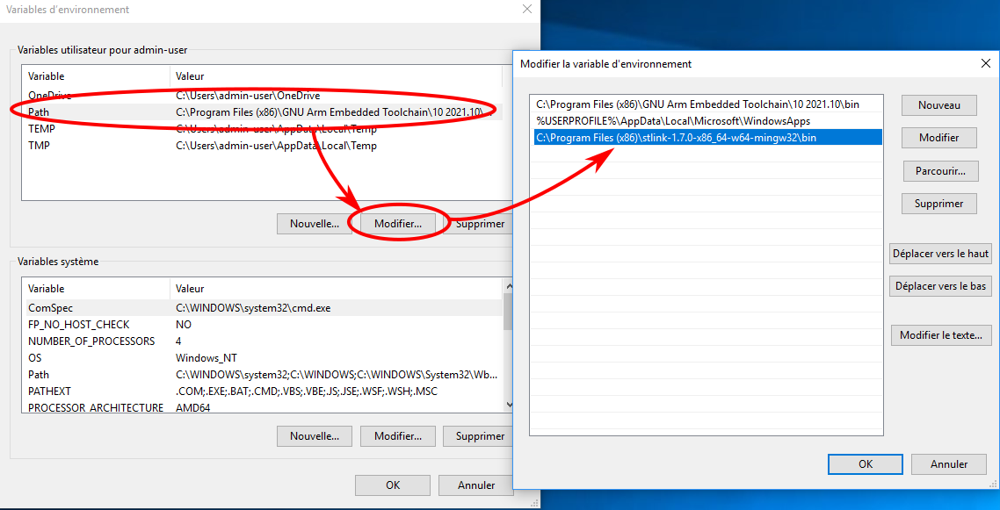
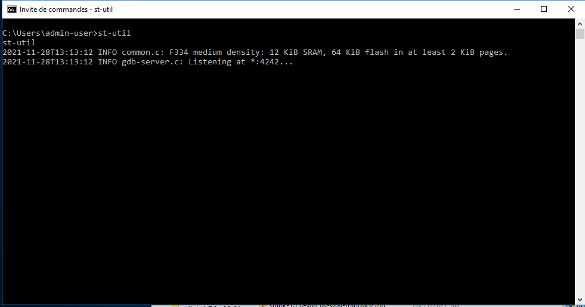
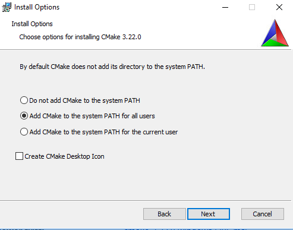

# Required tools: Cross-compiler, CMake, ST-Link

The target is a ST Nucleo32 board STM32F303K8.

Here, we use:
 * a cross-compiler for the cortex ARM target (`arm-none-eabi-gcc`)
 * a tool to upload and debug on the target: `st-link`
 * a tool to handle the project (compilation/flash recipes): `cmake`
 * an IDE (QtCreator, Eclipse, VSCode, …), or a lightweight editor (Vim, gedit, …)

The compiler suite is `arm-none-eabi-gcc`, the debugger `arm-none-eabi-gdb` (that can be used in command line interface, or through a gui like QtCreator or VSCode). The name stands for:
 * `arm`: the processor target
 * `none`: the operating system. Here `none` means that there is no operating system (baremetal)
 * `eabi` is Embedded Application Binary Interface and defines the rules to interact with other binaries (how to give the function arguments in the asm for instance)
 * `gcc` is the name for the `GNU Compiler collection`, a widely uses compiler.

 Here are some tips and links to install these tools on Linux, MacOS and Windows.

# Linux
On Linux (Debian/Ubuntu flavor), you should install:
 * `build-essential`
 * [st-link](https://github.com/texane/stlink)
 * [cmake build process software](https://cmake.org/download/)

## CMake
First the essential build tools and cmake
```sh
sudo apt-get install build-essential cmake
```

## Cross-compiler
The compiler can be downloaded through packages, but there are some problems with it, and the debugger (`arm-none-eabi-gdb`) is missing. You can download [a version provided by ARM](https://developer.arm.com/open-source/gnu-toolchain/gnu-rm/downloads).

The archive may be decompressed, and the environment variable PATH should be updated (here if the archive has been decompressed to `/path/to/gcc-arm`):
```sh
export PATH=/path/to/gcc-arm/bin:$PATH
```

This environment variable should be defined each time a terminal is opened, so you can add it in the script executed each time a terminal is opened (`~/.bashrc` or `~/.zprofile` or …).

Another way is to make a symbolic link from the executables to the `usr/local/bin`.

# STLink

The ST-Link tool (communication between the debugger gdb and the target) [can be found here](https://github.com/texane/stlink).

## Next…
As soon as all this stuff is correctly installed, you can configure an editor, such as [VSCode](./vscode.md) to develop your application.

# Mac OS

On Mac, XCode should be installed, with the command line tools (App Store). You should agree the license in terminal (it has already been done on computers of the lab):
```sh
sudo xcodebuild -license
```

## CMake

Packages for cmake build process software [can be found here](https://cmake.org/download/).

A recent version of the [CMake build process software](https://cmake.org/download/) should be installed.

## Cross-compiler and STLink

You can [download the compiler here.](https://developer.arm.com/open-source/gnu-toolchain/gnu-rm/downloads).

The ST-Link tool (communication between the debugger gdb and the target) [can be found here](https://github.com/texane/stlink).

The archive of both the compiler and stlink may be decompressed, and the environment variable PATH should be updated (here if the archive has been decompressed to `/path/to/gcc-arm`):
```sh
export PATH=/path/to/gcc-arm/bin:$PATH
export PATH=/path/to/stlink/bin:$PATH
```

This environment variable should be defined each time a terminal is opened, so you can add it in the file `~/.profile`, which is a script that is executed each time a terminal is opened on Mac.

## Next…
As soon as all this stuff is correctly installed, you can configure an editor, such as [VSCode](./vscode.md) to develop your application.


# Windows

## Cross compiler

The cross-compiler is [gcc for ARM and can be downloaded here](https://developer.arm.com/downloads/-/arm-gnu-toolchain-downloads)

You need to download the windows release `Windows (mingw-w64-i686) hosted cross toolchains`.

Once downloaded, you just have to run the installer. **Don't forget to click on the option `Add path to environment variable`!!!**

## ST-Link

### the tool

ST-Link [st-link](https://github.com/texane/stlink) => binary version [64 bits](https://github.com/stlink-org/stlink/releases/download/v1.7.0/stlink-1.7.0-x86_64-w64-mingw32.zip) and [32 bits](https://github.com/stlink-org/stlink/releases/download/v1.7.0/stlink-1.7.0-i686-w64-mingw32.zip).

information from [the README installation doc](https://github.com/stlink-org/stlink):

`As of Release v1.6.1 stand-alone Windows binaries are made available (again) on the release page of the project. Please ensure to select the correct version for your system (i686 or x86_64). The archive file can be unzipped to any desired location as it does not contain any hardcoded paths. However we suggest to move the unzipped application folder to C:\Program Files\ on 32-bit systems and to C:\Program Files (x86)\ on 64-bit systems (the toolset is 32-bit). [...]`

You should:
 * decompress the `.zip` file
 * copy the directory (`stlink-1.7.0-x86_64-w64-mingw32`) to the `c:\Program File (x86)`

Then, we have to make the tools available in the PATH:
 * using the `search` button on windows:



 * choose `environment variable` button (bottom of the dialog window):
  


 * Then update the `PATH` variable and add the path to the folder `bin/` of the ST-Link folder that was previously extracted.
  


You can check that the gcc path has been correctly set! (first line in the previous image)

### the driver

You need to install the signed drivers [that are provided by ST](https://www.st.com/content/my_st_com/en/products/development-tools/software-development-tools/stm32-software-development-tools/stm32-utilities/stsw-link009.html)

* download the archive (`en.stsw-link009_v2.0.2.zip`)
* unzip it, and run the instaler (`dpinst_amd64.exe`).

### Please test ST-Link!

Then you may try your st-link installation:
* open a terminal (search for `cmd.exe`):
* connect the STM32F303 board
* run `st-util`. You should see sth like:



* close the program with `[Ctrl]+C`.

## CMake + Ninja

The CMake build process software [can be downloaded here](https://cmake.org/download/). You should choose the `.msi` file (windows installer).

During installation, please check the `add CMake to the system PATH`. In the other case, you will have to do it manually, as for ST-Link.



CMake will need a generator, as explained in [this page](https://cmake.org/cmake/help/latest/manual/cmake-generators.7.html). On Unix (Linux/Mac), the generator `GNU Make` as already available. On Windows, this generator is not so easy to install. We will use `ninja`.

`Ninja` can be found [here](https://github.com/ninja-build/ninja/releases):
 * download the binary `ninja-win.zip`
 * unzip the zip file
 * move the binary file to a location in the windows path. An easy way is to mode the binary to the `CMake/bin` folder (`C:\Program Files\CMake\bin`). It will work directly.

## Next…
As soon as all this stuff (cross-compiler, cmake, ninja, st-link and its driver…) is correctly installed, you can configure an editor, such as [VSCode](./vscode.md) to develop your application.
