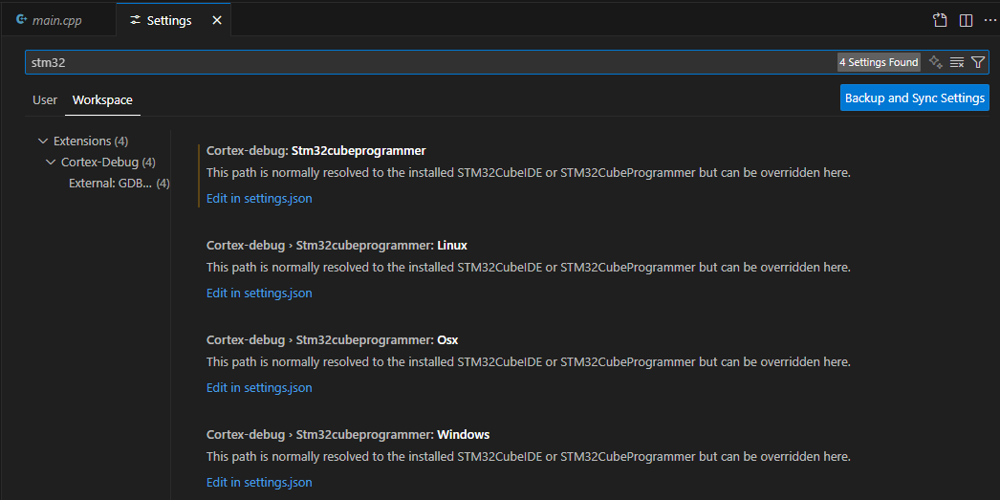
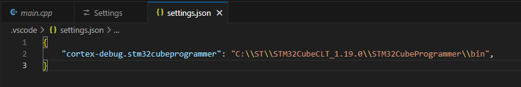

The target is a ST Nucleo32 board STM32F303K8.

Here, we use:
 * a cross-compiler for the cortex ARM target (`arm-none-eabi-gcc`)
 * a tool to upload and debug on the target: `st-link`
 * a tool to handle the project (compilation/flash recipes): `cmake` (+Ninja on Windows)
 * an IDE (QtCreator, Eclipse, VSCode, …), or a lightweight editor (Vim, gedit, …)

The compiler suite is `arm-none-eabi-gcc`, the debugger `arm-none-eabi-gdb` (that can be used in command line interface, or through a gui like QtCreator or VSCode). The name stands for:
 * `arm`: the processor target
 * `none`: the operating system. Here `none` means that there is no operating system (baremetal)
 * `eabi` is Embedded Application Binary Interface and defines the rules to interact with other binaries (how to give the function arguments in the asm for instance)
 * `gcc` is the name for the `GNU Compiler collection`, a widely uses compiler.

 # CLT - Command Line Tools

 ST provide an all-in-one tool to install all this stuff [here](https://www.st.com/en/development-tools/stm32cubeclt.html). An account is required to download the package.

From ST, the STM32CubeCLT toolset includes:
 * GNU C/C++ for Arm® toolchain executables such as arm-none-abi-gcc (compiler), arm-none-abi-nm (symbol viewer), and many more
 * GDB debugger client and server
 * STM32CubeProgrammer (STM32CubeProg) utility
 * System view descriptor files (.SVD) for the entire STM32 MCU portfolio
 * Map file associating STM32 MCUs and MCU development boards to the appropriate SVD

# VSCode Installation

you first need to install VSCode (from [here](https://code.visualstudio.com/download)). 

## Extensions

We first need to install some extensions. You can click on the *Extension* icon on the left side:


Then, you need to install the following extensions (using the *search extensions* dialog)
 * C/C++ (Microsoft)
 * C/C++ Extension Pack (Microsoft)
 * Cortex-Debug (marus25)
 * CMake tools (Microsoft)
 * vscode-pdf (tomoki1207), not required, but useful to show lab text, datasheets, …

Here is an example for the cortex extension:


## Specific configuration for *STM32 CLT*

If you have installed the CLT from ST on Windows, you have to update the stm32CubeProgrammer path (this tool is not installed at the same location as with STM32 Cube!!!):
 * open the settings dialog `File -> Preferences -> settings`, or `Ctrl+,`
 * search for `stm32cube`:



 * click to `Edit in settings.json`



add the line: (note that the `\` is double printed!)
```
    "cortex-debug.stm32cubeprogrammer": "C:\\ST\\STM32CubeCLT_1.19.0\\STM32CubeProgrammer\\bin",
```
