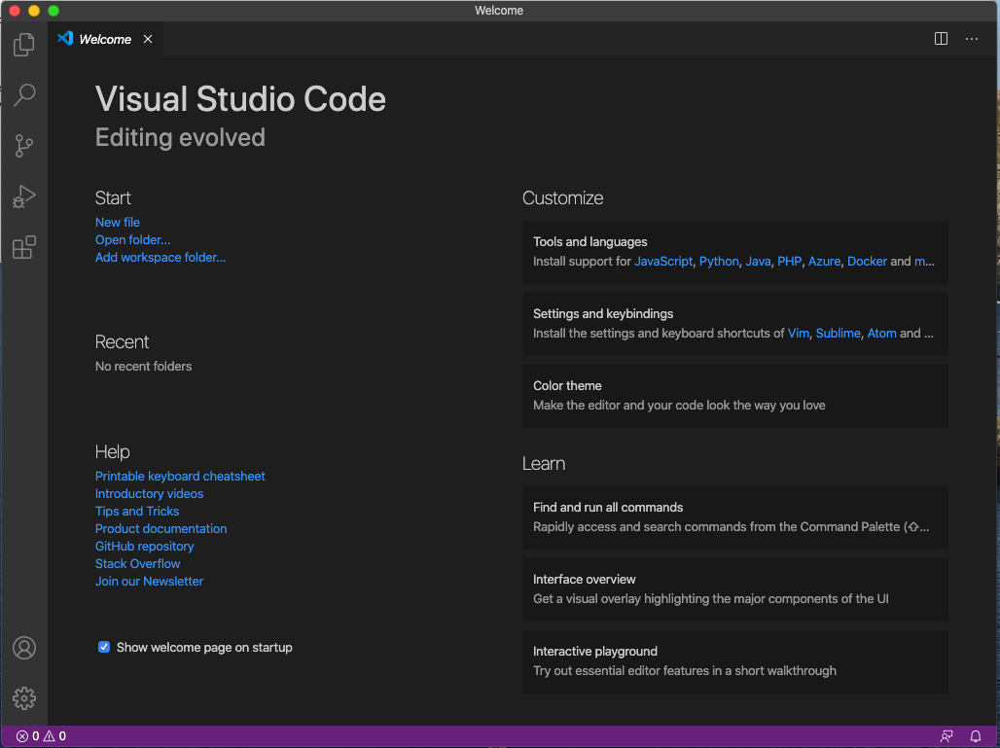
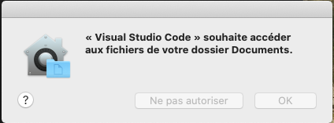
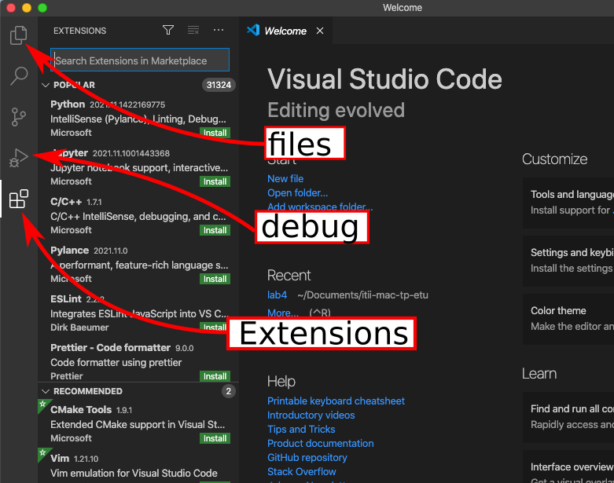
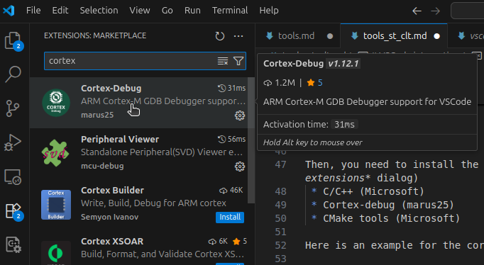
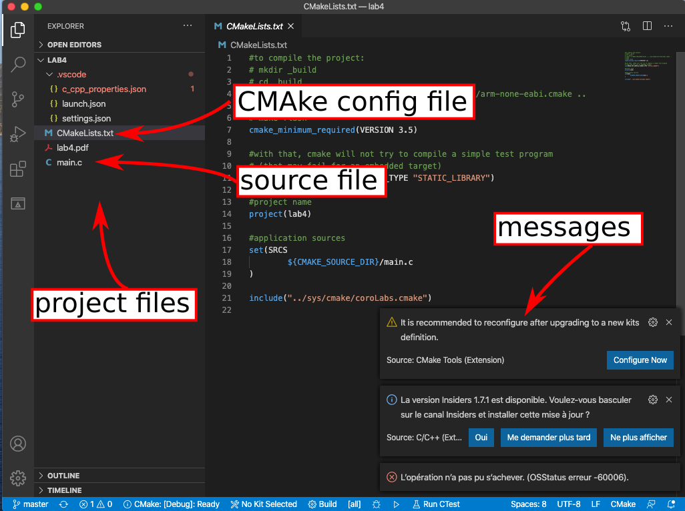
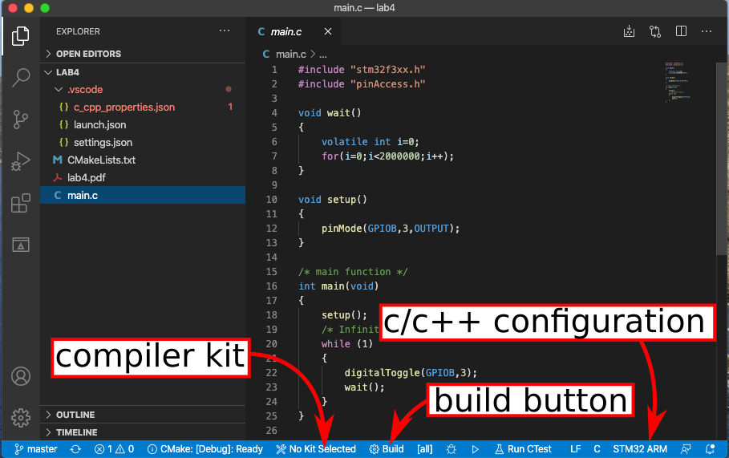
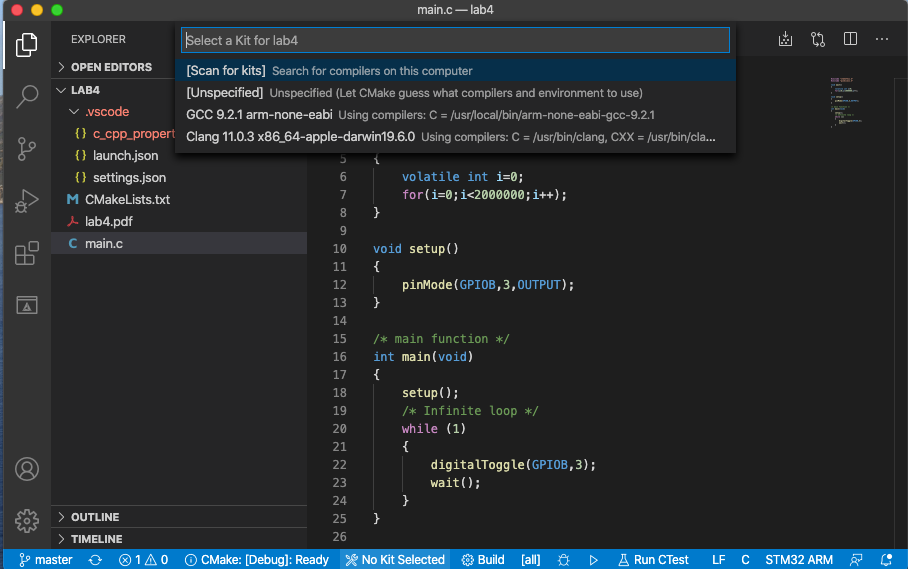
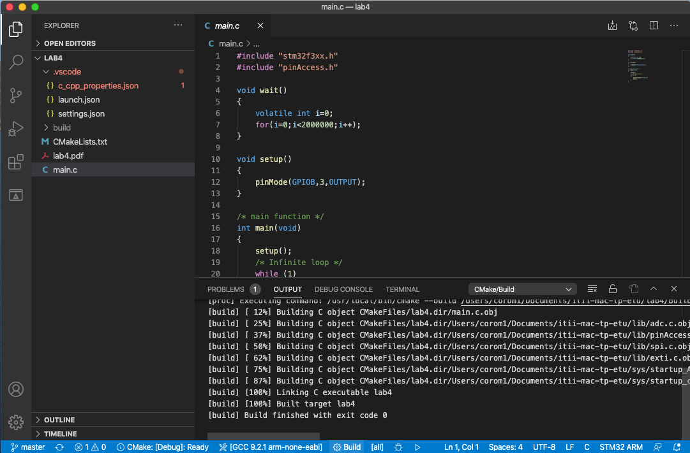
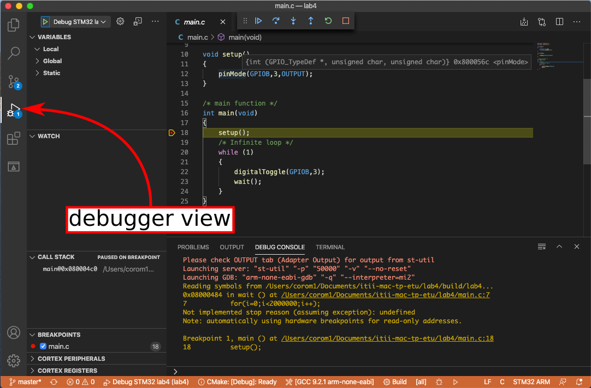
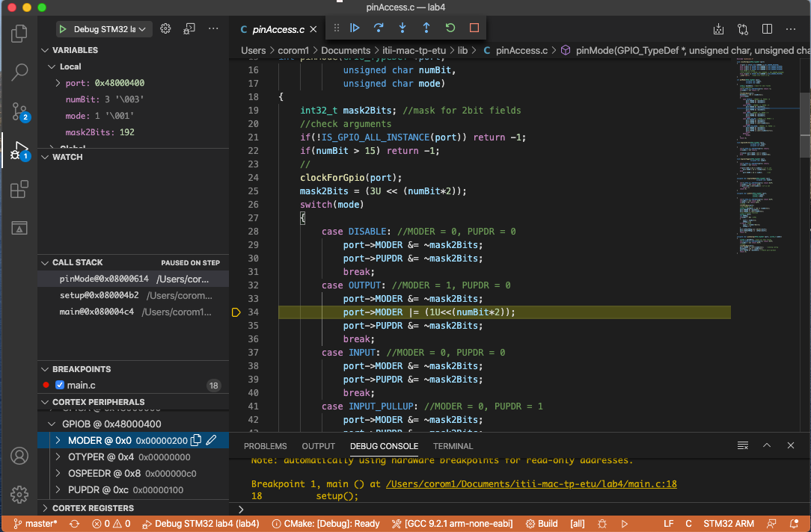

# VSCode integration

This *Howto* explains how to configure Microsoft VSCode for Cortex ARM development.

Sources: Some parts are based on [this web site](https://hbfsrobotics.com/blog/configuring-vs-code-arm-development-stm32cubemx) that uses ST CubeMX, VSCode and Makefiles on Windows.

## Prerequisites

Here, we use:
 * a cross-compiler for the cortex ARM target (`arm-none-eabi-gcc`)
 * a tool to handle the project (compilation/flash recipes): `cmake` (+`Ninja` on Windows)
 * a tool to upload and debug on the target: `st-link` (+its driver on Windows).

You can find [here](./tools.md) some information to install these tools.

**Important note**:
All these tools should be installed and the environment path updated! You can test: open a terminal and type: `arm-none-eabi-gcc --version`. The answer should be sth like:
```
-> % arm-none-eabi-gcc --version
arm-none-eabi-gcc (GNU Arm Embedded Toolchain 9-2020-q2-update) 9.3.1 20200408 (release)
Copyright (C) 2019 Free Software Foundation, Inc.
This is free software; see the source for copying conditions.  There is NO
warranty; not even for MERCHANTABILITY or FITNESS FOR A PARTICULAR PURPOSE.
```

## Configuration


### Start

The first time VSCode is started (on Mac, no extension):


On Mac, you should have some dialog boxes like this one to have access to the file system



(in french on D102, This means: vscode wants to access the files in your Documents folder)

### Extensions

We first need to install some extensions. You can click on the *Extension* icon on the left side:



Then, you need to install the following extensions (using the *search extensions* dialog)
 * C/C++ (Microsoft)
 * Cortex-debug (marus25)
 * CMake tools (Microsoft)

Here is an example for the cortex extension:



## Open a project

To open a project, simply open the appropriate folder: `File -> Open Folder`

There may have some messages. One of them is related to cmake: VSCode can use the CMake recipes to guess the project configuration (include paths, …). However, I get only a partial configuration. It's safer here to use the configuration provided, and *not use the cmake extension*!



You can see that there is a `.vscode` folder (hidden on Linux/Mac) that contains the full configuration:
 * `c_cpp_properties.json` give some information about the configuration of the C/C++ parts. The intelliSense mode for auto-completion needs it. It defines a configuration named `STM32 ARM`
 * `launch.json` get some information on how to use st-link when debugging.
 * `settings.json` just tells that CMake will use a cross compiler.

## Compilation

The *build* button is on the status bar in the bottom of the window.



A *compiler kit* should be selected. The first time, no *kit* is selected. One click on the `No kit selected` text leads to a menu:



You have to choose the `arm-none-eabi` kit. If the cross compiler does not appear, it means that the compiler is not well installed. Have a look to the path (environment variable for your OS).

as soon as the kit is selected, a click on the build button causes the compilation. If everything goes well, the message `Build finished with exit code 0` is printed:



## Debug session

For a debug session, just type **`F5`**, and choose the `debugger` view.



You can use the classic buttons:

 * play/stop: run and pause the application on the real target
 * step onto: step one line. If it is a function, execute it.
 * step into: step one line. If it is a function, just go inside the function.
 * step out: get out of the function
 * restart: reset the application
 * **close**: close **correctly** the debugger (so that next debug session will start more easily…)

 You can use all the debugger windows:
 * variables
 * watch
 * call stack (nested function calls)
 * breakpoints (remove, disable, …)
 * Cortex peripherals => register access.

