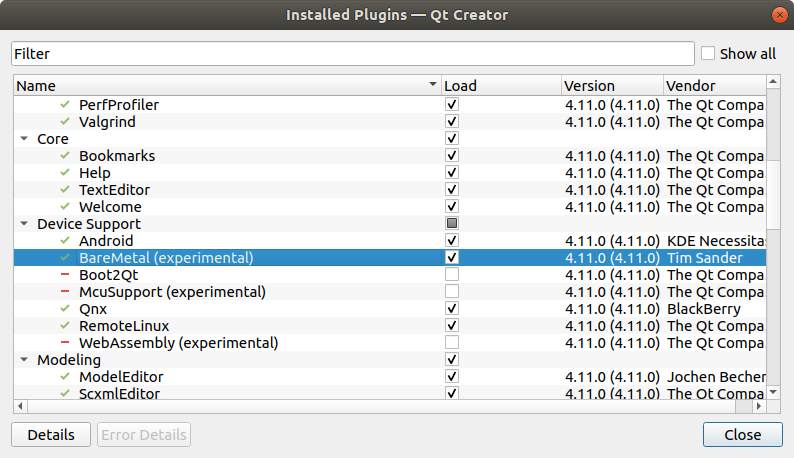
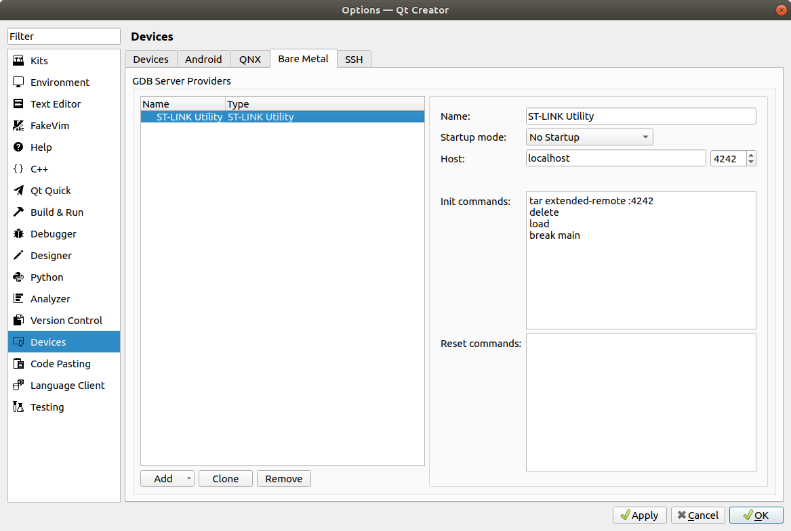
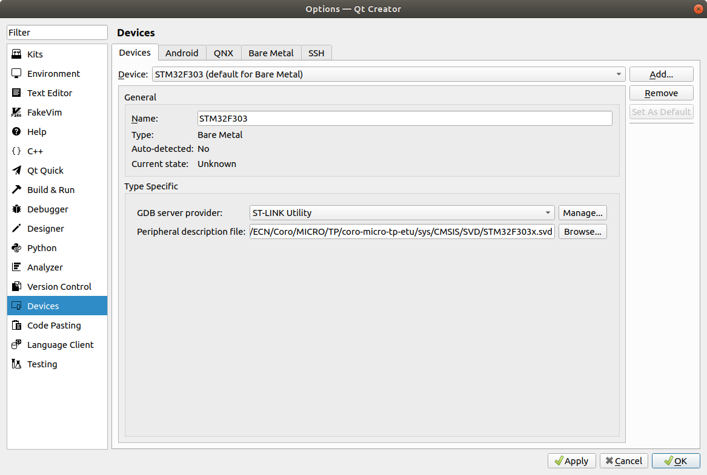
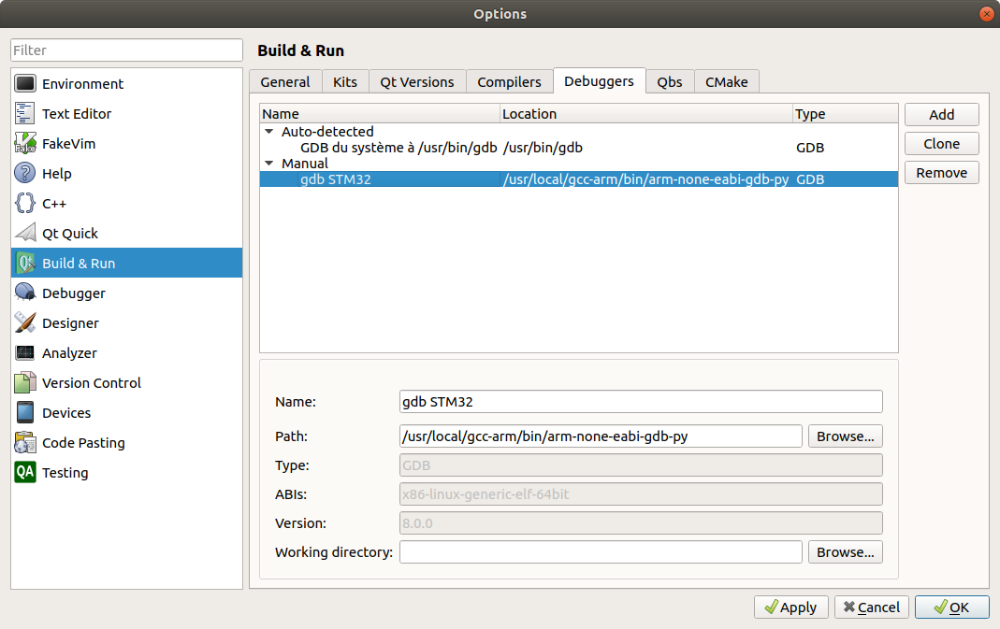
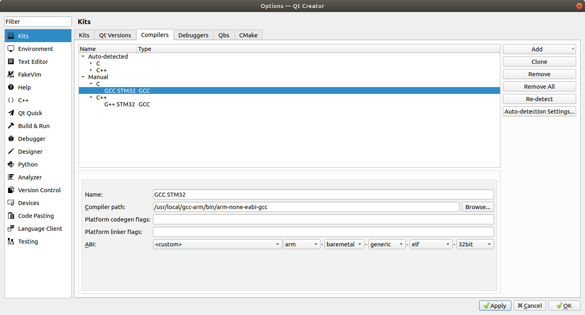
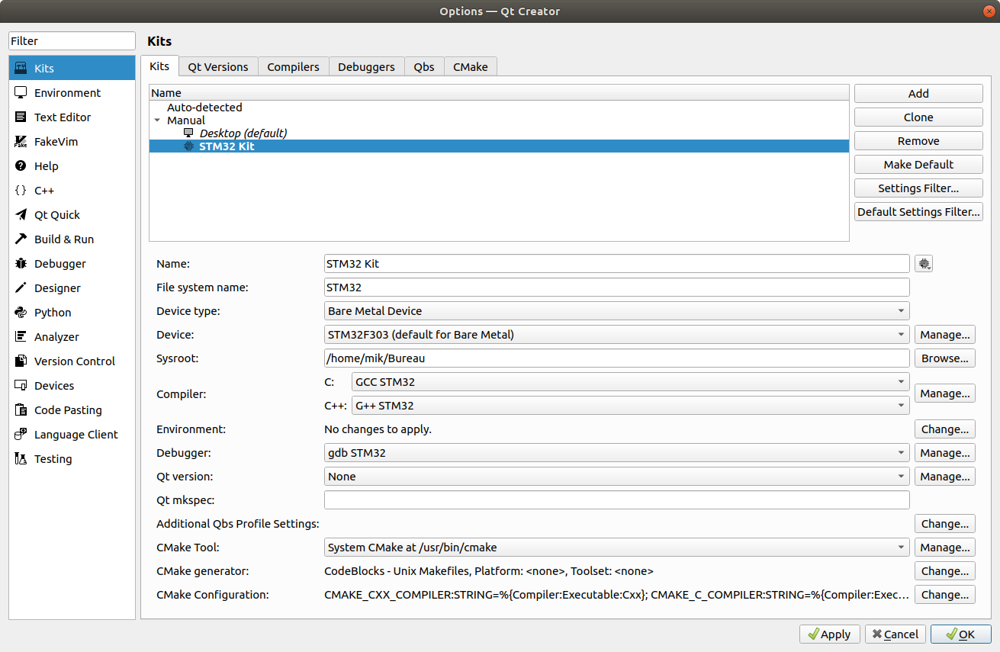

# STM32 Debug with QtCreator

QtCreator is eator is a cross-platform integrated development environment (IDE) that can be configured for the STM32. It embeds:
* a source editor
* a build system
* an easy-to-use graphical debugger interface

We focus here on how to use the debugger (instead of the command line gdb).

Tested with QtCreator 4.11.0. GCC for ARM should be installed first (compiler)

## Installation

 * install [QtCreator](https://www.qt.io/development-tools)
 * check for the BareMetal plugin in Help->About plugins…, and Device Support->BareMetal 

## Configuration

Qt Creator should be configured in 2 sections`tools->options`:

* the `Devices` part
* the `Kits` part

### Devices

Define the Device (how to connect to the device), in the `Devices` part:

 * In the tab `Bare Metal`, click `add->ST-LINK utility`
 

 * In the tab `Devices`, add a new device and associate it to the ST-LINK utility.
 * There is also a `peripheraldescription file` edit line. You can give the file `sys/CMSIS/SVD/STM32F303x.svd`. The SVD file give the information on the register set of the MCU, so that we can inspect the full configuration of the target chip during debug (peripheral view)
 

### Kits

In the `Kits` part:

  * First define the debugger `Debugger` tab:
 
 To know where is your gdb version, you can simply type in a terminal:
 ```sh
 which arm-none-eabi-gdb
 ```
 QtCreator requires to use a gdb version that embeddeds the python extension. it is the `arm-none-eabi-gdb-py` version in the GCC version provided by ARM.

 * You can set the cross-compiler. This is not required if you wants to debug only. Here, I have both set the C compiler (`gcc`) and the c++ compiler (`g++`). It is exactly the same configuration, just rename the compiler path from gcc to g++:
 

 * The we can define the `kit` that contains all the stuff (device/debugger) in `Kits` section:
 
 There is a warning in the Kit configuration if no compiler is associated.

## Debugging session

### Debug session start

To start a debugging session, the binary `.elf` should be generated:

```sh
make
```

Then, the `st-util` tool should be called. The utility makes the connection between the board and the computer (using the STLink protocol). In a terminal:

```sh
$ st-util
st-util 1.5.1-12-g30de1b3
2019-12-13T08:22:40 INFO common.c: Loading device parameters....
2019-12-13T08:22:40 INFO common.c: Device connected is: F3xx medium density device, id 0x10016438
2019-12-13T08:22:40 INFO common.c: SRAM size: 0x3000 bytes (12 KiB), Flash: 0x10000 bytes (64 KiB) in pages of 2048 bytes
2019-12-13T08:22:40 INFO gdb-server.c: Chip ID is 00000438, Core ID is  2ba01477.
2019-12-13T08:22:40 INFO gdb-server.c: Listening at *:4242...
```

If all is ok, st-util waits to a connection on `localhost:4242` port.

Then, we can connect to st-link using Qt Creator, in `Debug->Start debugging->Attach to Running Debug Server...`:
 * define the server port to 4242 (ST-util server port)
 * give the `Local executable` full path (path to the .elf file)

 

### Using debug session

Qt Creator acts only as a graphical user interface, and all the gdb command are now available using the GUI:

In the image just below:
 * the yellow arrow shows the next instruction that will be executed
 * the red dot is a `breakpoint`, where the program should stop. It is inserted/removed by a simple click just before the line number.


The program execution is controlled by the commands  (A tip label is displayed when the mouse gets over the buttons):
 * start/stop/resume commands
 * `step over` won't enter in a function, but execute it directly
 * `step into` will enter in a function so that it can be debugged

With the SVD file provided in the `Device` configuration, we can have a look at the peripheral state (in read-only mode at this date), using `window->views->Peripheral Registers`. Then, a right click on the peripheral register window to choose the peripheral to display. In the following capture, the GPIOB peripheral is displayed, and since the last breakpoint, the bit 3 of `ODR` has been updated (shown in red):


